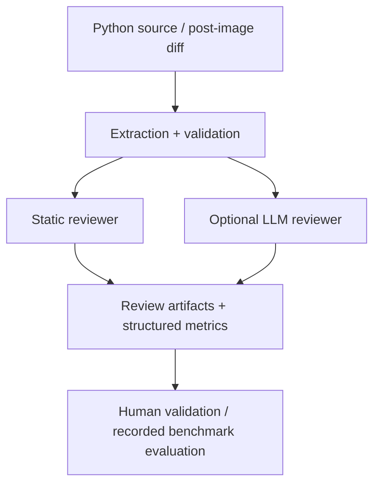

# CodeReviewLab

CodeReviewLab is a local Python review assistant built around deterministic static checks and a
configurable LLM review path. It is designed to help researchers and engineers review code changes
in a controlled, auditable, and offline-first workflow without claiming that model output is a
source of truth.

Every review result requires human verification. The project does not certify code correctness or
promote unsupported claims about model quality. The static path is narrow, explicit, and explainable;
the LLM path is optional and intentionally constrained.

## Architecture at a glance



Core responsibilities are deliberately separated:

- `src/codereviewlab/cli.py`: user-facing commands and exit semantics
- `src/codereviewlab/extraction.py`: source extraction, diff verification, line mapping
- `src/codereviewlab/static.py`: narrow static rules and AST-based issue detection
- `src/codereviewlab/llm.py`: local inference orchestration and output parsing
- `src/codereviewlab/config.py`: versioned configuration and validation
- `src/codereviewlab/dataset.py`: dataset contract validation and family/split checks
- `src/codereviewlab/evaluation.py`: benchmark evaluation, matching, and reporting
- `src/codereviewlab/training.py`: training validation and response-only LoRA setup
- `src/codereviewlab/reports.py`: artifact creation and safe output handling
- `src/codereviewlab/schemas.py`: strict model contracts for results and datasets

## Installation

Python 3.11+ is required. Python 3.11 or 3.12 is recommended for the current training stack. A
local virtual environment is strongly recommended.

```sh
python -m venv .venv
# Windows PowerShell
.venv\Scripts\Activate.ps1
# macOS/Linux
# source .venv/bin/activate

python -m pip install -U pip
python -m pip install -e ".[dev]"
codereviewlab --help
codereviewlab doctor
```

Optional capability groups are intentionally separated:

```sh
python -m pip install -e ".[inference]"
python -m pip install -e ".[training]"
```

Installation and help commands do not download model weights. Local inference and training are
explicitly opt-in actions.

## Quick start

```sh
codereviewlab review examples/sample.py --output reports/review.json
codereviewlab validate-dataset data/benchmark.jsonl
codereviewlab evaluate --dataset data/dev.jsonl --config configs/static.yaml --output reports/static-dev
git diff > changes.diff
codereviewlab review-diff changes.diff --repo . --output reports/diff.json
```

## Local development workflow

```sh
ruff check .
pytest --cov=src/codereviewlab --cov-report=term-missing --cov-fail-under=75
pre-commit install
```

Run `pre-commit run --all-files` before opening a pull request. That keeps the same checks used in
CI and reduces the chance of avoidable regressions.

## Production-readiness baseline

This project is not a public SaaS or autonomous code execution service. It is a reproducible local
research tool with a clear contract: it provides review suggestions, not verified bug fixes. The
current baseline is intentionally conservative and safety-oriented.

The project is considered production-ready for:

- local research and reproducible inspection workflows
- controlled benchmark evaluation in a trusted environment
- offline review workflows with strict configuration and explicit output paths
- human-in-the-loop code review with auditable artifacts

It is not considered production-ready for:

- unsupervised autonomous code modification
- broad claims of real-world bug-finding quality across arbitrary repositories
- deployment as a shared service without model governance, audit controls, and human review policy

## Operational boundaries

- No reviewed code is executed during review or evaluation.
- The static engine covers a small set of explicit syntactic patterns.
- LLM output is constrained by schema validation, but schema validation does not prove truth.
- Dataset validation enforces family/split and contract integrity instead of allowing silent drift.
- Artifact creation is protected from accidental overwrite; new paths are required.
- Exit codes are explicit: 0 success, 1 incomplete processing, 2 invalid configuration or input.

## Documentation map

- [docs/architecture.md](docs/architecture.md): design, contracts, invariants, extension points
- [docs/operations.md](docs/operations.md): release readiness, maintenance, and operational safety
- [docs/limitations.md](docs/limitations.md): known constraints and honest failure modes
- [docs/validation.md](docs/validation.md): executed checks and environment details
- [docs/model-card.md](docs/model-card.md): model scope and recorded assumptions
- [docs/dataset-card.md](docs/dataset-card.md): benchmark expectations and schema constraints
- [docs/experiments.md](docs/experiments.md): experiment history and recorded results
- [CONTRIBUTING.md](CONTRIBUTING.md): contributor workflow and PR expectations

## Contributing

Contributions are welcome. Please keep all user-facing text, documentation, and commit messages in
English, use a feature branch, and validate the change locally before opening a pull request.

```sh
python -m pip install -e ".[dev]"
ruff check .
pytest --cov=src/codereviewlab --cov-report=term-missing --cov-fail-under=75
python -m build
python -m pre_commit run --all-files
```

## Release process

Create a version tag such as `v0.1.1` and push it to GitHub to trigger the release workflow, which
builds the source distribution and wheel and uploads the artifacts to the matching GitHub release.

The project should be released only after the current validation checklist passes in a clean
environment and the release notes clearly document the exact benchmark status of the release.

## Real model and training runs

```sh
codereviewlab review examples/sample.py --config configs/baseline.yaml --allow-download --output reports/llm-review.json
codereviewlab evaluate --dataset data/dev.jsonl --config configs/baseline.yaml --allow-download --output reports/base-dev
python scripts/prompt_experiments.py --allow-download --output reports/prompts
codereviewlab evaluate --dataset data/test.jsonl --config configs/selected.yaml --output reports/base-test
codereviewlab train --config configs/lora-fixture.yaml --validate-only
codereviewlab train --config configs/lora-fixture.yaml --allow-download
codereviewlab train --config configs/lora.yaml --validate-only
codereviewlab train --config configs/lora.yaml --allow-download
codereviewlab evaluate --dataset data/test.jsonl --config configs/adapter.yaml --output reports/adapter-test
codereviewlab compare reports/base-test/metrics.json reports/adapter-test/metrics.json --output reports/comparison.md
```

`configs/lora.yaml` uses the separate author-generated `data/training.jsonl`: 48 examples in
12 training-only families, with reference cases verified in Docker. This dataset is an experiment
collection, not evidence of general reviewing quality. The small fixture is only a pipeline check.
The model cache remains offline unless `--allow-download` is explicitly provided.

To reproduce the training collection: `python scripts/build_training_data.py`.

## Validation status

See [docs/validation.md](docs/validation.md) for the exact checks and environment used in execution.
No real model inference claims are included unless they are explicitly recorded there. Mocked model
checks validate contracts; they are not evidence of model quality.

The project tracks benchmark results conservatively and keeps all quality claims explicitly scoped.
Actual results are documented in [docs/experiments.md](docs/experiments.md) and the comparison notes
in [docs/results/real-comparison-v3.md](docs/results/real-comparison-v3.md). Adapters are stored in
`checkpoints/fixture/adapter` and `checkpoints/lora/adapter`; weights, cache, and checkpoints are
ignored by Git.

```sh
python -m pytest
python -m ruff check .
python -m build
```
